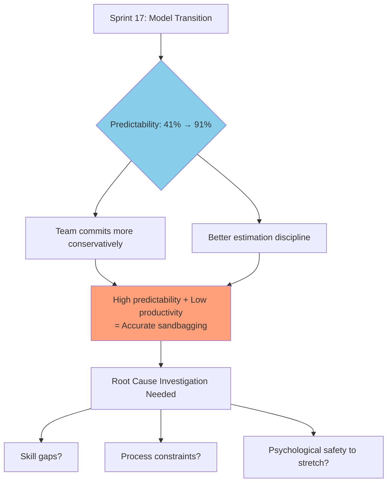
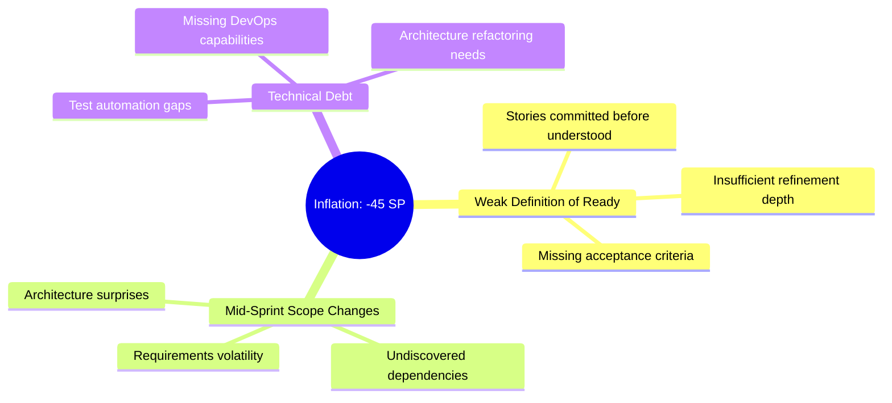

# DNE Team Performance Analysis Report
**Sprint Range:** S25.08 to S25.22 (15 sprints)  
**Team:** DNE (Digital Network Engineering)

---

## Executive Summary

**Key Findings:**
- **Dramatic Predictability Improvement:** 91% post-transition (up from 41%), but team is accurately predicting *low performance*
- **Productivity Gap:** Currently at 59% with 29 SP gap between delivery (40 SP) and target (69 SP)
- **Systematic Estimation Issues:** -45 SP inflation across 12 sprints indicates weak Definition of Ready
- **Unstable Baseline:** 48% coefficient of variation (benchmark: <15% for mature teams)

**Bottom Line:** Team has improved self-awareness but not yet capability. Not ready for EBP until velocity stabilizes.

---

## Performance Analysis

### 1. The Velocity Transition Paradox

**Sprint 17 Model Change:** 20 SP → 69 SP normalized target

**Impact:**
- Predictability jumped: 41% → 91% (123% improvement)
- Productivity rose modestly: 51% → 61% (20% improvement)
- **Key Insight:** Team learned to predict low performance accurately, not to perform at higher levels

---

### 2. Systematic Inflation Pattern

**Evidence:** 80% of sprints (12/15) required negative inflation corrections totaling -45 SP

**Root Causes:**

**Pattern:** Average -3 SP per sprint indicates systematic estimation dysfunction, not occasional miss

---

### 3. Sprint S25.14 Anomaly: 120% Productivity

**Only sprint exceeding target** - Delivered 30 SP with -6 inflation = 120% productivity

**Hypothesis:** Likely carryover from Sprint S25.13 (which only delivered 8 SP)

**Coaching Question:** "What was different about S25.14? Can we replicate it, or was it driven by prior sprint's incomplete work?"

---

### 4. External Factor Volatility

**Observed Impacts:**
- Sprint S25.19: Backend dev holiday → 41% productivity (but 91% predictability)
- Sprint S25.21: Diwali festival → 51% productivity (100% predictability)

**Key Insight:** Team demonstrates high predictability during constrained periods when forced to plan conservatively

**Implication:** Capacity-adjusted planning can maintain predictability while improving productivity ambition

---

### 5. Statistical Reality Check

| Metric | Old Model (20 SP) | New Model (69 SP) | Industry Benchmark |
|--------|-------------------|-------------------|-------------------|
| Avg Productivity | 51% | 61% | 75-85% |
| Avg Predictability | 41% | 91% | 70-80% |
| Coefficient of Variation | 52% | 24% | <15% |
| Inflation per Sprint | -3.2 SP | -2.5 SP | <1 SP |

**Current Baseline:** ~40-43 SP delivered per sprint (3-sprint moving average)
**Gap to Target:** 29 SP (42% shortfall)

---

## Coaching Conversation Framework

### Opening: Lead with Curiosity

**Frame the Conversation:**
> "I've analyzed your sprint data and see some interesting patterns. Before I share observations, I'm curious—what's your sense of how the team feels about their performance?"

### Discovery Questions by Theme

**On the Velocity Transition:**
- "What prompted the shift to 69 SP at Sprint 17?"
- "I notice predictability jumped from 41% to 91%. What do you attribute that to?"
- "How did the team experience that transition? What changed in planning?"

**On Productivity (59% vs 100% target):**
- "Your productivity hovers around 59%. How does the team talk about that?"
- "What would need to be different to consistently deliver 70-80% of committed work?"
- "Are certain types of stories consistently taking longer than estimated?"

**On Inflation Corrections (-45 SP across 12 sprints):**
- "Help me understand what drives these corrections—I see them in 80% of sprints"
- "When stories get split or re-estimated mid-sprint, what's usually happening?"
- "How confident is the team in estimates during planning?"

**On Sprint S25.14 (120% productivity):**
- "Sprint 14 was an outlier at 120%. What was different?"
- "Was this carryover from Sprint 13's low delivery, or did something fundamental change?"
- "How can we understand if this is repeatable capability?"

**On External Factors:**
- "When capacity is reduced (holidays, Diwali), how does the team adjust planning?"
- "I notice 100% predictability during constrained sprints. Why is that?"

### Insight Sharing: "Notice → Wonder → Explore"

**Example 1: Predictability Paradox**
- **Notice:** "Predictability improved dramatically—41% to 91%—after Sprint 17"
- **Wonder:** "I wonder if that's because you're committing more conservatively, or if estimation changed fundamentally"
- **Explore:** "Let's look at a few sprints together and see what patterns we find..."

**Example 2: Inflation Pattern**
- **Notice:** "I see -45 SP inflation across 12 sprints, averaging -3 SP each time"
- **Wonder:** "I wonder if this signals weak Definition of Ready, or if something else is going on"
- **Explore:** "What if we categorized these corrections by root cause—would patterns emerge?"

**Example 3: High Predictability, Low Productivity**
- **Notice:** "You're hitting 91% predictability but only 59% productivity"
- **Wonder:** "I wonder if the team is 'sandbagging'—committing only to what they're certain they can deliver"
- **Explore:** "What would need to be true for you to commit to 55 SP and feel confident?"

### Co-Creating Solutions (Not Prescribing)

**Avoid:** "You should..." or "The team needs to..."

**Instead Use:**
- "What if we tried an experiment where..."
- "I've seen teams in similar situations try X. Does that resonate here?"
- "Given what we're learning, what feels like the right next step?"
- "How would the team react if we..."

### Addressing EBP Readiness

**Be Direct and Supportive:**
> "I need to share a concern. Based on this data, the team isn't ready for Epic-Based Pricing yet. Here's why: [show velocity variance, inflation pattern, productivity gap].
>
> But here's what I also see—a team that's improving, becoming more honest about capacity, and has a clear path forward. The question isn't *if* you'll be ready, but *when*. What would need to happen for you to feel confident about EBP?"

### Facilitation Techniques

**Pattern Recognition Exercise:**
- Display sprint data visually
- Ask: "What patterns jump out at you?"
- Listen for: blame vs. system thinking, defensiveness vs. curiosity

**Hypothesis Testing Together:**
- "Let's test a hypothesis: What if inflation corrections are driven by weak DoR?"
- Review 3-5 stories with corrections
- Identify common patterns collaboratively

**Stretch Goal Experiment Design:**
- "What if next sprint we commit to 45 SP baseline plus 10 SP stretch goals?"
- "Pull stretch work only if baseline is on track by mid-sprint"
- "Let's see what we learn about true capacity"

---

## Risk Assessment

| Risk | Evidence | Impact | Coaching Response |
|------|----------|--------|-------------------|
| **Unstable Baseline** | 48% CV (benchmark: <15%) | EBP contract disputes | Facilitate velocity stabilization period |
| **Persistent Inflation** | -45 SP across 12 sprints | Revenue/margin leakage | Root cause analysis workshop |
| **Low Productivity** | 59% vs 100% target | Margin compression | Productivity lever identification |
| **Sandbagging Pattern** | 91% predictability + low productivity | Underutilization | Stretch goal experiments |
| **External Volatility** | Holiday impacts: -20-30% swings | Delivery unpredictability | Capacity-adjusted planning |

---

## Recommended Coaching Interventions

### Inflation Root Cause Workshop
**Purpose:** Categorize all -45 SP corrections to identify systemic patterns
**Method:** 
- Review each inflation correction with team
- Categorize: DoR failure, scope change, technical surprise, estimation error
- Identify top 3 root causes
- Co-create preventive measures

**Success Indicator:** <2 SP inflation in subsequent sprints

### Estimation Confidence Protocol
**Purpose:** Prevent stories from being committed before understood
**Method:**
- Score each story 1-5 confidence during refinement
- <3 confidence = split story or run time-boxed spike
- Track confidence scores vs. actual inflation

**Success Indicator:** 50% reduction in mid-sprint scope changes

### Capacity-Adjusted Planning
**Purpose:** Maintain high predictability during constrained periods
**Method:**
- Pre-sprint capacity assessment (team availability %)
- Adjusted Velocity = Base Velocity × Capacity %
- Document capacity assumptions in sprint goals

**Success Indicator:** 95%+ predictability regardless of capacity constraints

### Stretch Goal Experiment
**Purpose:** Determine if team can push beyond comfortable commitment
**Method:**
- Commit to baseline (45 SP) + stretch goals (10 SP)
- Pull stretch work only if baseline on track mid-sprint
- Debrief: psychological safety, estimation accuracy, true capacity

**Success Indicator:** Learn whether 91% predictability masks sandbagging

### Velocity Stabilization Focus
**Purpose:** Establish reliable baseline for commercial model
**Method:**
- Target: 6 consecutive sprints with <10% variance from mean
- Track 3-sprint moving average convergence
- Identify and remove volatility sources

**Success Indicator:** Coefficient of Variation <15%

### Productivity Lever Pilot
**Purpose:** Test specific interventions to close 42% gap
**Method:**
- Identify top 3 productivity constraints (from team input)
- Pilot solutions: AI tools (Claude MCP), test automation, DevOps training
- Measure: velocity change, inflation reduction, team satisfaction

**Success Indicator:** 10% productivity gain within 8 weeks

---

## Visual Analysis Dashboard

[View Performance Analysis](computer:///mnt/user-data/outputs/dne_team_analysis.png)

**Dashboard Insights:**
- **Top Left:** Productivity trend shows gradual improvement with high volatility
- **Top Right:** Predictability jumps at model transition (S25.17)
- **Middle Left:** Commitment vs delivery gap persists across sprints
- **Middle Right:** New model shows tighter distribution but lower median
- **Bottom Left:** Inflation corrections predominantly negative
- **Bottom Center:** Scatter plot reveals sandbagging pattern (high predictability, low productivity cluster)
- **Bottom Right:** Moving averages converging to 40-43 SP baseline

---

## Bottom Line for Coaching

**What the Team Has:**
- Honest self-assessment (91% predictability)
- Positive improvement trend (+10% over baseline)
- Transparency about constraints and challenges

**What the Team Needs:**
- Permission to establish realistic baseline (40-45 SP, not 69 SP)
- Investment in productivity enablers (tools, training, automation)
- Support to experiment with stretch commitments safely

**What to Avoid:**
- Pressure to "deliver faster" without addressing root causes
- Treating 69 SP as non-negotiable target despite lack of evidence
- Implementing EBP before baseline stabilizes

**Coaching Stance:**
- Celebrate increased self-awareness and predictability
- Frame current state as "learning phase," not "failure"
- Partner with team to co-create path to higher performance
- Protect team from premature commercial model pressure

**Next Conversation Prep:**
Schedule 90-minute team debrief to:
1. Share data observations (not conclusions)
2. Facilitate pattern recognition by team
3. Co-create hypotheses about root causes
4. Design 2-3 experiments for next sprints
5. Establish success metrics they own

---

**Prepared by:** Enterprise Transformation Coaching AI  
**For:** Sanjay Gupta, Enterprise Coach
