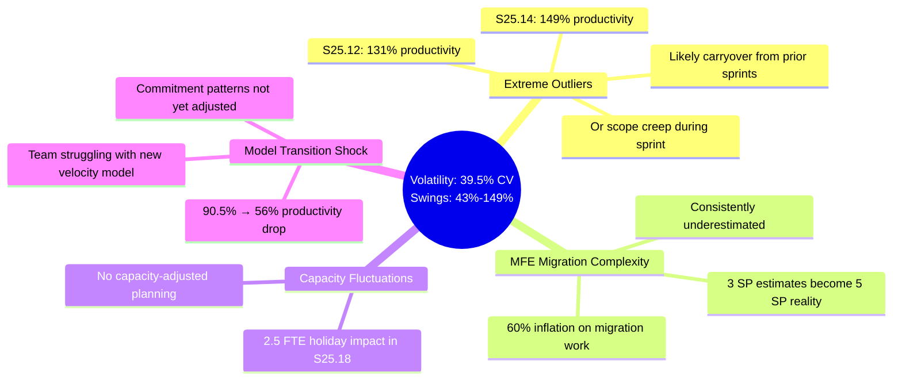
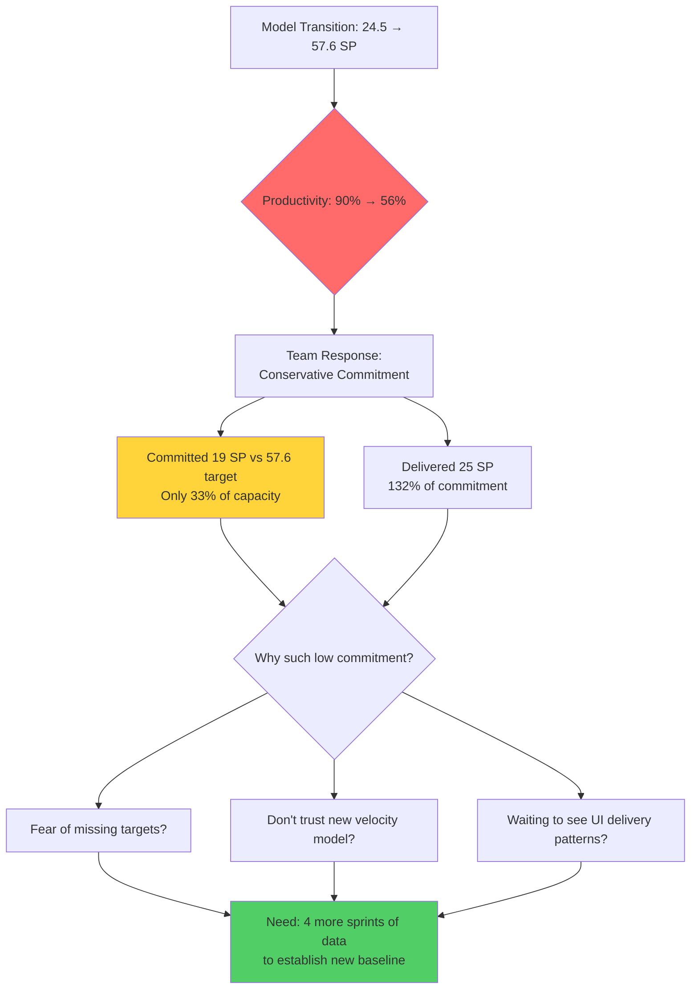
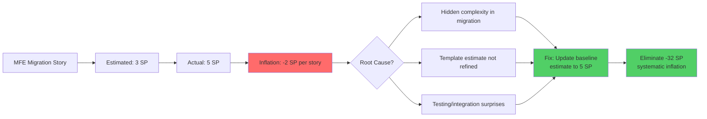
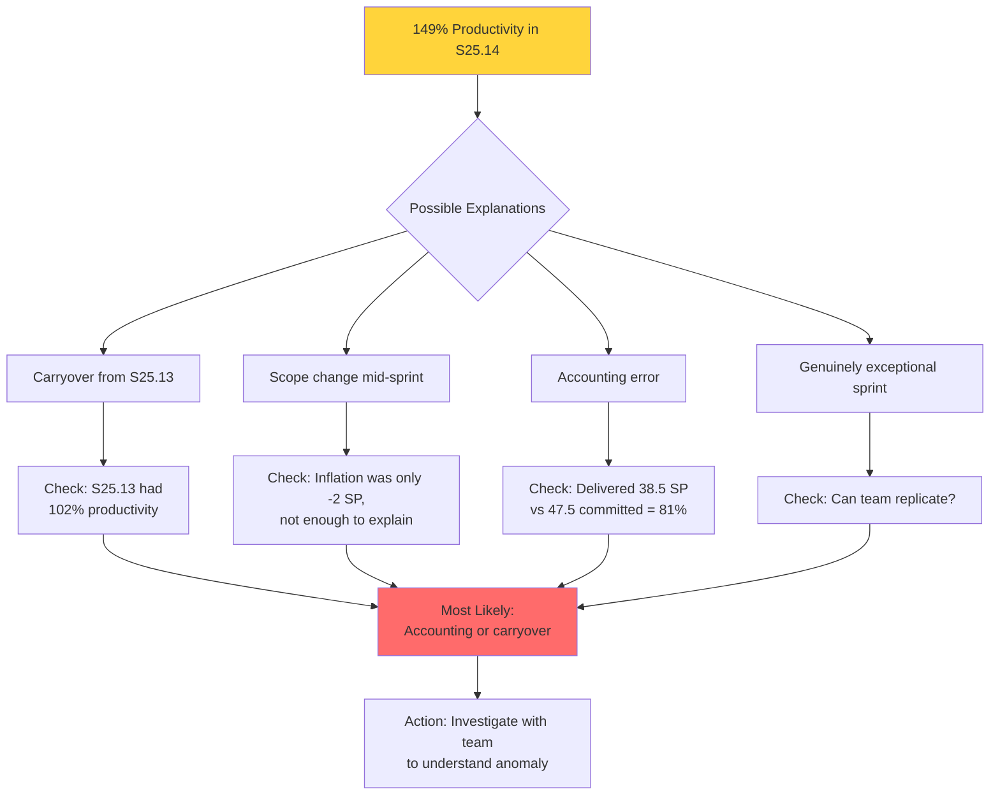
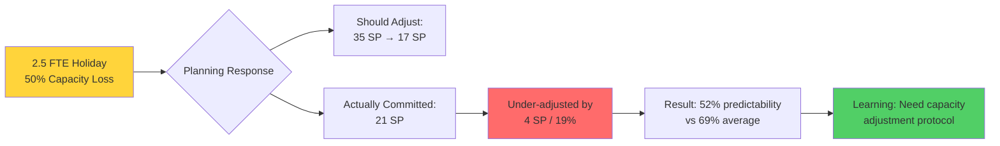
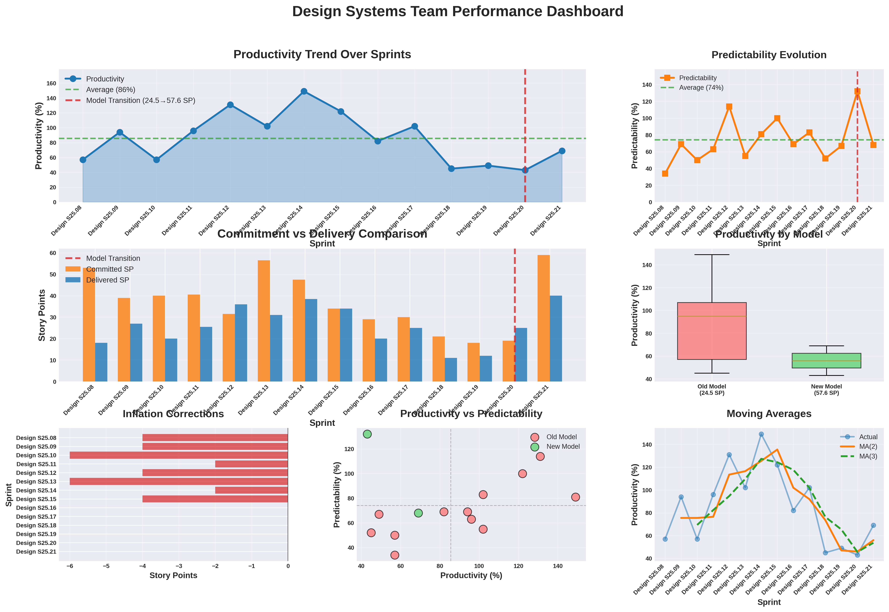

# Design Systems Team Performance Analysis Report
**Sprint Range:** Design S25.08 to Design S25.21 (14 sprints)
**Team:** Design Systems

---

## Executive Summary

**Key Findings:**
- **High Capability, High Volatility:** 86% average productivity (exceeding 75-85% benchmark) with severe instability—39.5% coefficient of variation (benchmark: <15%)
- **Model Transition Productivity Collapse:** 90.5% → 56% productivity drop after switching from 24.5 SP to 57.6 SP target at S25.20
- **Systematic MFE Migration Underestimation:** 8 sprints with inflation corrections (-32 SP total) driven by consistent 3 SP → 5 SP MFE component story adjustments
- **Extreme Outlier Sprints:** 149% productivity (S25.14) and 131% (S25.12) indicate carryover, scope changes, or accounting issues—not sustainable performance

**Bottom Line:** Team demonstrates strong capability but lacks predictable baseline. Not ready for EBP until volatility is reduced 60% and new model productivity stabilizes above 70%.

---

## Performance Analysis

### 1. The Volatility Crisis: 39.5% Coefficient of Variation

**Industry Benchmark:** <15% CV for mature teams ready for commercial engagement
**Design Systems Reality:** 39.5% CV—productivity swings from 43% to 149% across sprints

This is not "normal variance"—this is systemic instability that prevents reliable forecasting.

**Coaching Insight:** When productivity ranges from 43% to 149%, the team cannot reliably commit to epics or fixed-price work. This isn't about effort—it's about process predictability.

---

### 2. Model Transition Productivity Collapse

**Sprint S25.20 Change:** 24.5 SP → 57.6 SP normalized target (2.35x increase)

**Impact Analysis:**

| Metric | Old Model (24.5 SP) | New Model (57.6 SP) | Change |
|--------|-------------------|-------------------|--------|
| Avg Productivity | 90.5% | 56.0% | **-38% drop** |
| Avg Predictability | 69.7% | 100.0% | +43% |
| Avg Delivered SP | 27.7 | 32.5 | +17% |
| Sprint Count | 12 sprints | 2 sprints | Limited data |

**Critical Observation:** Predictability went to 100% (team hitting commitments) but productivity dropped 38%. This suggests the team is **committing extremely conservatively** under the new model to guarantee hitting targets.

**Key Question:** Is 56% productivity the new reality, or is the team sandbagging until they understand the new model's expectations?

---

### 3. The MFE Migration Inflation Pattern

**Evidence:** 8 sprints (57% of total) had inflation corrections, all driven by same root cause

**Pattern Breakdown:**
- **S25.08:** 2 MFE stories inflated 3 → 5 SP (-4 SP total)
- **S25.09:** 2 MFE stories inflated 3 → 5 SP (-4 SP)
- **S25.10:** 3 MFE stories inflated 3 → 5 SP (-6 SP)
- **S25.11:** 1 MFE story inflated 3 → 5 SP (-2 SP)
- **S25.12:** 2 MFE stories inflated 3 → 5 SP (-4 SP)
- **S25.13:** 3 MFE stories inflated 3 → 5 SP (-6 SP)
- **S25.14:** 1 MFE story inflated 3 → 5 SP (-2 SP)
- **S25.15:** 2 MFE stories inflated 3 → 5 SP (-4 SP)

**Total Impact:** -32 SP across 8 sprints = persistent 60% underestimation of MFE migration work

**Coaching Insight:** This isn't an estimation problem—it's a learning problem. After 8 sprints of 3 SP → 5 SP inflation, the team should update their baseline MFE estimate to 5 SP. Repeating the same mistake 14+ times signals process breakdown.

---

### 4. Extreme Outlier Sprints: 149% and 131% Productivity

**Anomalies:**
- **S25.14:** 149% productivity (delivered 38.5 SP, committed 47.5 SP, but productivity 149% of target)
- **S25.12:** 131% productivity (delivered 36 SP, committed 31.5 SP)

**Hypothesis Testing:**

**Key Concern:** When sprints show 149% productivity followed by 122%, 102%, and then collapse to 43-49% in later sprints, it suggests:
1. Work started in prior sprints is being counted in later sprints
2. Scope is shifting mid-sprint without proper tracking
3. Accounting methodology is inconsistent

**None of these are sustainable or predictable patterns.**

---

### 5. Capacity-Adjusted Planning Absence

**S25.18 Evidence:** "2.5 FTE on Holiday" → Productivity dropped to 45%

**Missing Practice:** Team did not adjust commitment for known 50% capacity reduction

**What Should Have Happened:**
- Normal commitment: ~35 SP
- Adjusted for 50% capacity: ~17 SP
- Actual commitment: 21 SP (40% reduction, not 50%)
- Result: Delivered 11 SP = 52% of commitment

**Pattern:** Team partially adjusted but not enough, suggesting weak capacity planning discipline

---

## Coaching Conversation Framework

### Opening: Celebrate Strengths, Name Concerns

**Frame the Conversation:**
> "I've analyzed 14 sprints of your team's data, and I see some really impressive capability—86% average productivity is above industry benchmarks. But I also see patterns that concern me, and I want to understand them with you. Can we walk through this together?"

### Discovery Questions by Theme

**On High Productivity + High Volatility:**
- "Your average productivity is 86%, which is excellent. But it swings from 43% to 149%. What's driving those extremes?"
- "How does it feel to the team when productivity jumps from 102% to 149% to 122%, then crashes to 45%?"
- "When you deliver 149% productivity, what's actually happening? Is it carryover, scope change, or something else?"
- "How confident are you in sprint-to-sprint predictability right now?"

**On Model Transition (90% → 56%):**
- "Productivity dropped from 90% to 56% after the model change at S25.20. Walk me through what happened."
- "I notice predictability went to 100% in the new model—you're hitting commitments. But productivity is 56%. Are you committing more conservatively?"
- "In S25.20, you committed 19 SP against a 57.6 SP target—that's 33% of capacity. What drove that decision?"
- "Do you trust the new 57.6 SP velocity model, or does it feel off?"
- "What would need to be true for you to commit to 40-45 SP in the new model?"

**On MFE Migration Inflation (3 SP → 5 SP, 8 sprints):**
- "I see a clear pattern: MFE migration stories estimated at 3 SP consistently become 5 SP. After 8 sprints of this, why is the baseline still 3 SP?"
- "What's the hidden complexity in MFE migrations that's not captured in the 3 SP estimate?"
- "Is this a refinement issue, a template issue, or something about the work itself?"
- "If you started estimating MFE migrations at 5 SP tomorrow, would inflation drop to zero?"

**On Extreme Outliers (149%, 131%):**
- "S25.14 shows 149% productivity. Can you walk me through that sprint—what actually happened?"
- "When productivity exceeds 130%, is that carryover from prior sprints, or scope expansion mid-sprint?"
- "How do you account for work that starts in one sprint and finishes in another?"
- "Are there inconsistencies in how stories are scored across sprints?"

**On Capacity Planning:**
- "S25.18 had 2.5 FTE on holiday. Did the team adjust commitment accordingly?"
- "How do you typically handle capacity reductions—holidays, training, production support?"
- "If you knew 50% of the team would be out, what would be your target commitment?"

**On S25.20 UI Delivery Note:**
- "The note says 'More dev stories delivered that didn't need UI work.' Does this mean UI is a bottleneck?"
- "How do you plan sprints when UI capacity is constrained?"
- "Should dev-only stories and UI-dependent stories be tracked separately?"

### Insight Sharing: "Notice → Wonder → Explore"

**Example 1: Volatility Red Flag**
- **Notice:** "Productivity ranges from 43% to 149% across 14 sprints—that's a 39.5% coefficient of variation"
- **Wonder:** "I wonder if this is driven by outliers, or if something about the work itself is inherently unpredictable"
- **Explore:** "What if we categorized sprints by type of work—MFE migrations, new features, bug fixes—and checked if volatility is tied to work type?"

**Example 2: MFE Estimation Learning Curve**
- **Notice:** "8 sprints show the exact same pattern: MFE stories estimated at 3 SP become 5 SP"
- **Wonder:** "I wonder why the baseline estimate hasn't updated after the first 3-4 sprints of consistent underestimation"
- **Explore:** "What if we ran a retrospective specifically on MFE work—what makes it harder than the 3 SP estimate suggests?"

**Example 3: Model Transition Impact**
- **Notice:** "Productivity dropped 38% after the model change, but predictability went to 100%"
- **Wonder:** "I wonder if the team is committing very conservatively because the new model feels unfamiliar"
- **Explore:** "What if we ran 3-4 sprints as 'learning sprints' where you experiment with higher commitments—baseline + stretch goals—to find the real capacity?"

### Co-Creating Solutions (Not Prescribing)

**Avoid:** "You need to fix your estimation process" or "Stop sandbagging"

**Instead Use:**
- "What if we updated the MFE baseline estimate to 5 SP and tracked if inflation drops?"
- "Given the model transition, what feels like a safe experiment—commit to 40 SP baseline + 10 SP stretch, and see what you learn?"
- "How would you design a capacity adjustment protocol for holidays and other predictable constraints?"
- "What if we tracked UI-dependent vs dev-only stories separately to understand the bottleneck better?"

### Addressing EBP Readiness

**Be Direct and Supportive:**
> "I need to be transparent: with 39.5% volatility and a 90% → 56% productivity swing in the new model, the team isn't ready for Epic-Based Pricing yet. Here's why—EBP requires a stable baseline where we can predict epic delivery within ±10%. Right now, sprint-to-sprint swings make that impossible.
>
> But here's the path forward: You have 86% average productivity, which is strong. If we can:
> 1. Stabilize the new model over 4-6 sprints to establish a true baseline
> 2. Fix the MFE inflation pattern (should be a quick win)
> 3. Bring volatility down to <20% CV (from 39.5%)
>
> ...then you'll be in a very strong position. The capability is there. We just need predictability to match."

---

## Risk Assessment

| Risk | Evidence | Impact | Coaching Response |
|------|----------|--------|-------------------|
| **Extreme Volatility** | 39.5% CV (benchmark: <15%) | EBP forecasting unreliable, contract disputes | Volatility reduction focus: categorize root causes |
| **Model Transition Instability** | 90% → 56% productivity drop after S25.20 | New baseline unclear, team may be sandbagging | Run 4-6 learning sprints to establish true capacity |
| **Systematic MFE Underestimation** | 3 SP → 5 SP inflation across 8 sprints | Persistent -32 SP inflation, margin leakage | Update baseline to 5 SP, eliminate repetitive error |
| **Outlier Accounting Issues** | 149% and 131% productivity sprints | Data integrity questions, unreliable metrics | Investigate anomalies, tighten story accounting |
| **Capacity Planning Gaps** | S25.18: 50% capacity loss, only 52% predictability | Holiday/absence impacts not mitigated | Implement capacity adjustment protocol |
| **UI Bottleneck Risk** | S25.20 note: dev stories bypassed UI work | Hidden constraint, delivery unpredictability | Separate UI-dependent and dev-only story tracking |

---

## Recommended Coaching Interventions

### 1. MFE Migration Baseline Correction Workshop
**Purpose:** Eliminate -32 SP systematic inflation by fixing root cause

**Method:**
- Retrospective on all 14 MFE migration stories that inflated 3 → 5 SP
- Identify common complexity drivers: testing, integration, refactoring
- Update baseline estimate to 5 SP for all future MFE migrations
- Track next 5 sprints to validate inflation elimination

**Success Indicator:** Zero inflation on MFE stories in next 3 sprints (vs -4 to -6 SP previously)

---

### 2. New Model Baseline Discovery Sprints
**Purpose:** Establish reliable productivity baseline under 57.6 SP model

**Method:**
- Commit to 4 consecutive "learning sprints" with stretch goals
- Sprint formula: Baseline (35 SP) + Stretch (10 SP) = 45 SP commitment
- Pull stretch work only if baseline is on track mid-sprint
- Track actual delivery to determine true sustainable capacity
- Adjust normalized target if 57.6 SP proves unrealistic

**Success Indicator:** 4 sprints with <15% variance from mean, establishing stable baseline

---

### 3. Volatility Root Cause Analysis
**Purpose:** Reduce 39.5% CV to <20% by identifying instability drivers

**Method:**
- Categorize all 14 sprints by: Work Type (MFE, greenfield, bugs), Team Capacity, Outliers
- Calculate CV by category to isolate volatility sources
- Identify top 3 drivers (e.g., MFE complexity, capacity fluctuations, carryover)
- Design targeted interventions for each driver
- Re-measure CV after 6 sprints

**Success Indicator:** CV drops from 39.5% to <25% within 8 weeks

---

### 4. Outlier Sprint Investigation
**Purpose:** Understand 149% and 131% productivity sprints to prevent recurrence

**Method:**
- Deep-dive with team on S25.12 and S25.14
- Questions: What work was delivered? Was it started in prior sprint? Any scope changes?
- Review story accounting methodology—are points scored consistently?
- Establish clear "work complete in sprint" definition
- Implement sprint boundary discipline

**Success Indicator:** No sprints >120% productivity in next 6 sprints (unless genuinely exceptional and repeatable)

---

### 5. Capacity-Adjusted Planning Protocol
**Purpose:** Maintain predictability during holidays, absences, and constraints

**Method:**
- Pre-sprint capacity calculation: Available FTE / Total FTE × Baseline Velocity
- Adjust commitment by capacity percentage
- Document capacity assumptions in sprint goal
- Track predictability during constrained sprints vs. normal sprints
- Refine adjustment formula based on results

**Success Indicator:** 80%+ predictability maintained during constrained capacity sprints (vs 52% in S25.18)

---

### 6. UI Bottleneck Visibility Experiment
**Purpose:** Determine if UI is a constraint requiring separate tracking

**Method:**
- Tag stories: "UI-dependent" vs "Dev-only" for 4 sprints
- Track delivery rates separately
- Measure: % UI stories completed, % dev stories completed
- Identify if UI capacity is limiting overall throughput
- If yes: adjust sprint planning to match UI capacity

**Success Indicator:** Clear data on whether UI is bottleneck; if yes, commitment adjusted accordingly

---

## Visual Analysis Dashboard

**Dashboard Insights:**
- **Top Left:** Productivity oscillates wildly—94% → 57% → 96% → 131% pattern shows severe instability
- **Top Right:** Predictability ranges 34-132%, indicating both over-commitment and under-commitment extremes
- **Middle Left:** Delivery frequently exceeds commitment (S25.12, S25.14, S25.15), suggesting scope creep or accounting issues
- **Middle Right:** Old model (24.5 SP) shows much higher productivity (90%) vs new model (56%)—clear transition shock
- **Bottom Left:** Inflation bars concentrated in first 8 sprints (MFE pattern), then disappear—team learned but didn't update baseline
- **Bottom Center:** Scatter plot shows wide distribution—no clear clustering, confirming high volatility
- **Bottom Right:** Moving averages diverge significantly from actuals, confirming instability

**Most Critical Insight:** The dashboard reveals a team with high capability but no stable operating rhythm. The model transition at S25.20 triggered a conservative response (56% productivity) that masks the team's true potential.

---

## Bottom Line for Coaching

**What the Team Has:**
- Exceptional productivity capability (86% average, 90% under old model)
- Strong commitment hit rate (100% predictability in new model when committing conservatively)
- Learning agility (inflation dropped to zero after S25.15)

**What the Team Needs:**
- Volatility reduction from 39.5% to <20% CV
- New model baseline stabilization (4-6 sprints of consistent performance)
- MFE estimation correction (3 SP → 5 SP baseline update)

**What to Avoid:**
- Pressuring for higher commitments before new model baseline is established
- Treating 149% productivity as "success" without understanding root cause
- Implementing EBP before volatility is below 20% CV

**Coaching Stance:**
This is a high-performing team experiencing growing pains from a model transition and systematic estimation gaps. The 86% average productivity proves capability. The 39.5% volatility proves the operating model isn't yet stable.

**Do not treat this as a performance problem.** Treat it as a process maturity opportunity.

The path forward:
1. **Quick win:** Fix MFE baseline (3 → 5 SP) to eliminate -32 SP inflation
2. **Learning phase:** Run 4-6 sprints with stretch goals to find true capacity under new model
3. **Stabilization:** Track CV sprint-over-sprint until it drops below 20%

If the team executes these interventions, they can achieve stable 75-80% productivity with <15% CV within 12 weeks—making them EBP-ready.

**Next Conversation Prep:**

Schedule 90-minute working session to:
1. **Celebrate strengths** (5 min): "86% productivity is exceptional. Let's build on that."
2. **Walk through dashboard** (15 min): Let team see volatility pattern and react
3. **MFE deep-dive** (20 min): Why does 3 SP → 5 SP keep happening? Fix it now.
4. **Model transition discussion** (25 min): "90% → 56% is a big drop. What's driving conservative commitment?"
5. **Design experiments** (25 min): Co-create baseline discovery sprints with stretch goals

**Prepare to hear:**
- Frustration about model change
- Concern that 57.6 SP target feels unrealistic
- Explanation of MFE complexity that wasn't understood initially

**Be ready to ask:**
- "What would a realistic target velocity be based on what you know now?"
- "If we gave you 4 sprints to experiment, what would you try?"
- "What's the one change that would make the biggest difference?"

---

**Prepared by:** Enterprise Transformation Coaching AI
**Analysis Date:** 2025-11-08
**Sprint Range Analyzed:** Design S25.08 through Design S25.21 (14 sprints)
