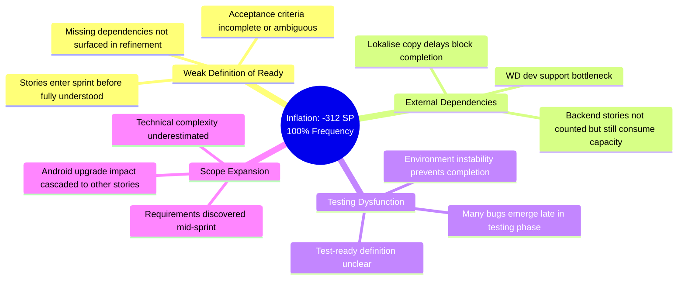
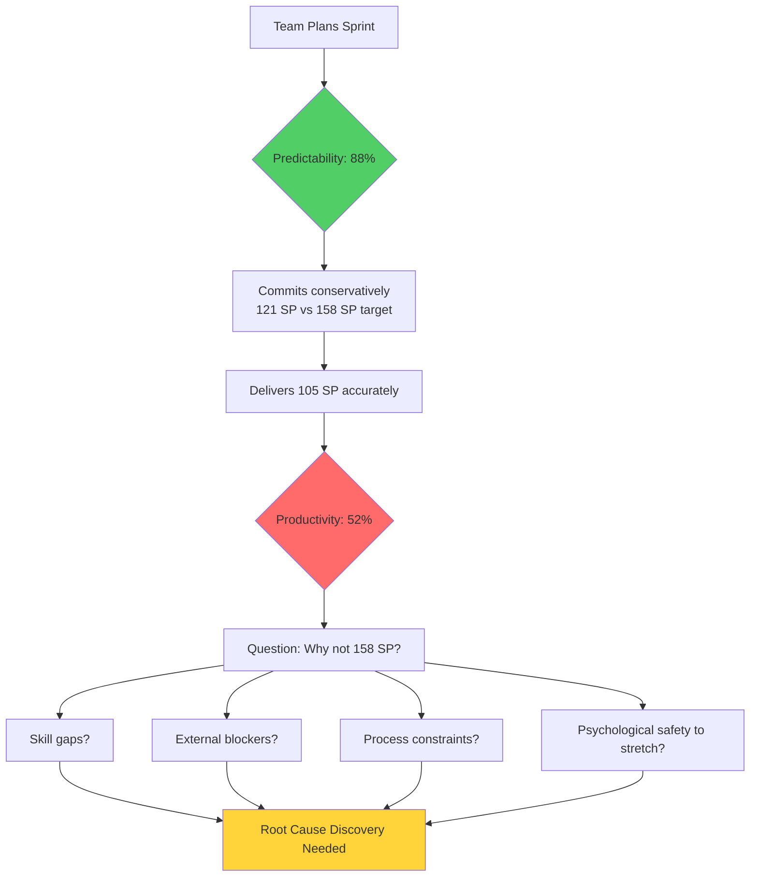
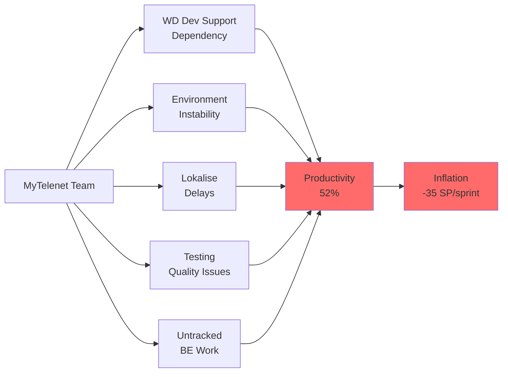

# MyTelenet-app Team Performance Analysis Report
**Sprint Range:** S25.8 to S25.22 (9 sprints with complete data)
**Team:** MyTelenet-app

---

## Executive Summary

**Key Findings:**
- **Critical Inflation Dysfunction:** -312 SP corrections across 9 sprints (100% of sprints require negative adjustments averaging -35 SP each)
- **High Predictability, Modest Productivity:** 88% predictability but only 52% productivity indicates conservative planning without capability buildup
- **Velocity Transition Without Impact:** Model change (120 SP → 158 SP at S25.19) showed no productivity improvement, suggests systemic constraints
- **External Dependency Bottleneck:** Heavy reliance on WD dev support, testing environment instability, and tooling delays consistently block delivery

**Bottom Line:** Team has strong planning discipline but faces severe execution barriers. Not ready for EBP until inflation is reduced by 80% and productivity reaches 65%+.

---

## Performance Analysis

### 1. The Inflation Crisis: 100% Sprint Corrections

**Evidence:** Every single sprint (9/9) required negative inflation corrections, totaling -312 SP with average of -35 SP per sprint

This is not estimation variance—this is systematic breakdown in story readiness and scope control.

**Coaching Insight:** When 100% of sprints require -35 SP corrections, the team is not "bad at estimation"—the Definition of Ready is non-functional.

---

### 2. High Predictability Masking Low Capability

**Pattern:** 88% predictability (within industry benchmark) + 52% productivity (well below 75-85% target) = accurate prediction of underperformance

**Analysis:**
- Team commits to ~121 SP and delivers ~105 SP with 88% accuracy
- But normalized target is 158 SP—team is delivering 67% of capacity
- 15 SP average gap per sprint compounds to 135 SP per quarter

**Key Question:** Is the team accurately forecasting systemic constraints, or sandbagging due to fear of missing commitments?

---

### 3. Model Transition Failed to Unlock Capacity

**Sprint S25.19 Change:** 120 SP → 158 SP normalized target

**Impact Analysis:**

| Metric | Old Model (120 SP) | New Model (158 SP) | Change |
|--------|-------------------|-------------------|--------|
| Avg Productivity | 52.4% | 51.0% | -1.4% |
| Avg Predictability | 90.8% | 83.7% | -7.1% |
| Avg Delivered SP | 96.2 | 119.7 | +24.4% |
| Inflation per Sprint | -32.8 SP | -37.5 SP | Worse |

**Interpretation:** Team committed more under new model but didn't improve productivity percentage. Inflation worsened, suggesting increased pressure without addressing root causes.

**Hypothesis:** Increasing velocity targets without fixing execution blockers creates stress without performance gain.

---

### 4. External Dependency Cascade

**Evidence from Sprint Notes:**
- **S25.10:** "Some team members working very long hours" (sign of struggle)
- **S25.11:** "Still lot of support needed from WD devs for frontend dev"
- **S25.12:** "Stories could not be completed in testing due to environment instability"
- **S25.13:** "Stories could not be completed due to lokalise (copy) delay issues"
- **S25.14:** "Still lots of support needed from WD devs. Many bugs come out of testing"
- **S25.15:** "Android upgrade story by lead Android dev impacted other story deliveries"
- **S25.16:** "BE stories not counted but made big steps in delivery" (capacity consumed, not reflected)

**Pattern:** Team is blocked by:
1. Frontend dependency on WD developers (skills gap)
2. Testing environment reliability (infrastructure)
3. Copy/localization tooling delays (process)
4. Late-stage bug discovery (quality process)
5. Backend work consuming capacity but not tracked (accounting issue)

---

### 5. Stability Assessment: Borderline Mature

**Coefficient of Variation:** 16.3% (benchmark: <15% for mature teams)

**Positive Signal:** Team is close to stable velocity baseline
**Concern:** Stability achieved at low productivity level (52%), not high performance

**3-Sprint Moving Average Trend:**
- S25.14-16: Declining from 63% → 45%
- S25.17-19: Recovering 42% → 64%
- S25.20-22: Stabilizing around 47%

**Current Baseline:** ~105 SP delivered per sprint (vs 158 SP target = 53 SP gap)

---

## Coaching Conversation Framework

### Opening: Lead with Curiosity and Care

**Frame the Conversation:**
> "I've been looking at your sprint data, and I see a team that's working incredibly hard—some notes mention very long hours. Before I share what I'm seeing, I'm curious: how does the team feel about their current rhythm? What's the energy like?"

### Discovery Questions by Theme

**On the Inflation Pattern (100% of sprints):**
- "Every sprint has required inflation corrections averaging -35 SP. Help me understand what's happening—what does that feel like to the team?"
- "When you commit to stories in planning, how confident is the team that those stories are truly ready?"
- "What would need to be different in refinement for you to trust estimates more?"
- "These corrections often come from scope changes or missing dependencies. What patterns do you see?"

**On External Dependencies:**
- "I notice frequent mentions of needing WD dev support. Tell me about that relationship—how does it work?"
- "When frontend devs need WD support, what's the typical wait time? How does that impact flow?"
- "The lokalise delays and environment instability show up in multiple sprints. Are these being escalated? What's the response?"
- "How does the team handle it when critical blockers are outside your control?"

**On Productivity (52% vs 75%+ target):**
- "You're delivering about 105 SP per sprint against a 158 SP target. What does the team think about that gap?"
- "If I asked the team 'What would need to change to consistently deliver 120+ SP?', what would they say?"
- "Are there specific types of stories that always take longer than estimated?"

**On Testing and Quality:**
- "I see notes about many bugs coming out of testing and environment instability. Walk me through the testing process—where are the friction points?"
- "When stories fail in testing, what's usually the root cause—requirements, code quality, test environment?"
- "How confident is the team when they mark something as 'dev complete'?"

**On the Model Transition:**
- "The velocity model changed from 120 to 158 SP at S25.19. What prompted that change?"
- "How did the team experience that transition? Did it feel like more pressure, or just different accounting?"
- "I notice productivity percentage stayed flat. Does the team feel they're delivering more, or just scoring it differently?"

**On Long Hours and Sustainability:**
- "One note mentioned team members working very long hours. Is that still happening?"
- "What's driving that? Is it deadline pressure, complexity, blockers, or something else?"
- "How sustainable does the current pace feel to the team?"

### Insight Sharing: "Notice → Wonder → Explore"

**Example 1: The Inflation Red Flag**
- **Notice:** "I see -312 SP in inflation corrections across 9 sprints—that's every single sprint with an average of -35 SP"
- **Wonder:** "I wonder if this signals that stories aren't truly ready when they're pulled into the sprint, or if it's something else entirely"
- **Explore:** "What if we took the last 5 sprints and categorized each inflation correction by root cause—would we see a pattern emerge?"

**Example 2: High Predictability, Low Productivity**
- **Notice:** "You're hitting 88% predictability, which is excellent—but productivity is at 52%, well below the 75-85% industry benchmark"
- **Wonder:** "I wonder if the team is committing conservatively to avoid missing goals, or if there are real constraints limiting capacity"
- **Explore:** "What would happen if you ran a stretch goal experiment—commit to 105 SP baseline plus 20 SP stretch goals, and only pull stretch work if you're on track mid-sprint?"

**Example 3: External Dependency Trap**
- **Notice:** "WD dev support shows up in 4 out of 9 sprint notes as a blocker"
- **Wonder:** "I wonder if the frontend team needs upskilling to reduce that dependency, or if WD owns specific architecture that requires their involvement"
- **Explore:** "Could we map out all the WD touchpoints and categorize them: skills transfer, architecture ownership, or code review? That might show where to focus."

### Co-Creating Solutions (Not Prescribing)

**Avoid:** "You need to fix your Definition of Ready" or "The team should work faster"

**Instead Use:**
- "What if we ran a Definition of Ready workshop and had the team define what 'sprint-ready' actually means?"
- "I've seen teams struggling with external dependencies try a 'dependency map' exercise. Would that be useful here?"
- "Given the testing issues, what feels like the right next step—environment fixes, earlier testing, or better dev-complete criteria?"
- "How would the team react if we proposed a 'no inflation' sprint as an experiment—what would need to be true?"

### Addressing EBP Readiness

**Be Direct and Supportive:**
> "I need to share a difficult truth: based on this data, the team isn't ready for Epic-Based Pricing yet. Here's why—52% productivity means we can't reliably predict epic delivery, and 100% inflation rate means scope control is broken.
>
> But—and this is important—I also see a team with 88% predictability, which means you have strong planning discipline. You're close to stability (16% CV). The capability is there; it's being blocked by systemic issues: dependencies, environment, quality process.
>
> The question isn't *if* you'll be ready for EBP, but *what needs to happen first*. What would need to change for you to feel confident committing to epic delivery with commercial risk?"

---

## Risk Assessment

| Risk | Evidence | Impact | Coaching Response |
|------|----------|--------|-------------------|
| **Inflation Dysfunction** | -312 SP across 9 sprints (100% frequency, -35 SP avg) | Scope creep, margin erosion, contract disputes | Facilitate DoR workshop to identify systemic causes |
| **External Dependency Bottleneck** | WD dev support mentioned in 4/9 sprints | Unpredictable delivery, team frustration, schedule slippage | Dependency mapping + skills transfer plan |
| **Testing Process Breakdown** | Environment instability, late bug discovery | Rework, reduced velocity, quality issues | Testing maturity assessment + environment investment |
| **Low Productivity Baseline** | 52% vs 75-85% benchmark, 53 SP gap per sprint | Revenue gap, margin compression, team morale | Root cause analysis: skills, tools, process |
| **Untracked Capacity Consumption** | BE work not counted in S25.16, Android upgrade cascaded | Invisible work, inaccurate forecasting | Story accounting audit + capacity visibility |
| **Burnout Risk** | "Very long hours" noted in S25.10 | Attrition, quality degradation, sustainability crisis | Workload assessment + sustainable pace intervention |

---

## Recommended Coaching Interventions

### 1. Inflation Root Cause Eradication Workshop
**Purpose:** Reduce -35 SP average inflation to <5 SP through systemic fixes

**Method:**
- Review all -312 SP corrections across 9 sprints
- Categorize each: weak DoR, external dependency, scope change, testing issue, estimation error
- Identify top 3 root causes by SP impact
- Co-create preventive measures with team
- Establish "sprint-ready" checklist enforced at planning

**Success Indicator:** <10 SP inflation in next 3 sprints (70% reduction)

---

### 2. External Dependency Liberation Plan
**Purpose:** Reduce WD dev dependency from critical blocker to occasional consult

**Method:**
- Map all WD touchpoints: skills gaps, architecture ownership, code reviews
- Categorize: "Can transfer knowledge" vs "Must remain WD-owned"
- Design skills transfer plan for frontend capabilities
- Establish WD engagement SLA with escalation path
- Pilot self-sufficient sprint with WD consult-only model

**Success Indicator:** 50% reduction in WD-blocked stories within 2 sprints

---

### 3. Testing Process Stabilization
**Purpose:** Eliminate testing environment instability and late-stage bug discovery

**Method:**
- Environment reliability audit: uptime, configuration drift, data quality
- Define "dev-complete" criteria: unit tests, integration tests, manual smoke test
- Implement shift-left testing: earlier QA involvement, automated smoke tests
- Escalate environment issues to infrastructure team with business impact
- Pilot "test-first" approach for 3 stories

**Success Indicator:** Zero "testing environment blocked" notes in next 3 sprints

---

### 4. Definition of Ready Hardening
**Purpose:** Prevent stories from entering sprint before they're truly understood

**Method:**
- Facilitate team workshop: "What makes a story sprint-ready?"
- Create DoR checklist: acceptance criteria, dependencies, estimate confidence, test approach
- Score each story 1-5 confidence during refinement
- <3 confidence = split story or run time-boxed spike
- Review DoR violations post-sprint to refine criteria

**Success Indicator:** 80% of stories meet DoR at planning (tracked via checklist)

---

### 5. Stretch Goal Productivity Experiment
**Purpose:** Determine if 52% productivity reflects true capacity or conservative planning

**Method:**
- Commit to baseline (100 SP) + stretch goals (20 SP) for 2 sprints
- Pull stretch work only if baseline is on track by mid-sprint review
- Debrief: Did team sandbag? Did stretch goals create stress? What was learned?
- Adjust baseline based on evidence

**Success Indicator:** Learn true capacity ± 10 SP, establish new realistic baseline

---

### 6. Capacity Accounting Transparency Protocol
**Purpose:** Track all work consuming capacity, not just planned stories

**Method:**
- Log unplanned work: production support, WD consults, spikes, bugs
- Categorize: planned, unplanned-necessary, unplanned-avoidable
- Calculate "capacity tax" % consumed by unplanned work
- Adjust sprint commitment by capacity tax percentage
- Address avoidable unplanned work root causes

**Success Indicator:** 95% of capacity accounted for in sprint planning

---

## Visual Analysis Dashboard

**Dashboard Insights:**
- **Top Left:** Productivity fluctuates 42-64% with slight decline post-transition, showing instability despite 16% CV
- **Top Right:** Predictability consistently high (76-96%), demonstrating strong planning discipline
- **Middle Left:** Consistent 15-20 SP gap between commitment and delivery across all sprints
- **Middle Right:** Box plot shows new model (158 SP) slightly lower productivity than old model (120 SP)—transition didn't help
- **Bottom Left:** All inflation bars are red (negative), averaging -35 SP per sprint—100% dysfunction rate
- **Bottom Center:** Scatter plot shows tight cluster in "high predictability, modest productivity" quadrant—classic sandbagging or constrained capacity pattern
- **Bottom Right:** Moving averages converging around 50-52% productivity baseline

**Most Critical Insight:** The combination of 100% negative inflation, persistent external dependencies, and testing issues suggests the team is in a "trapped productivity" state—they know how to plan but can't execute at target level due to systemic blockers.

---

## Bottom Line for Coaching

**What the Team Has:**
- Strong planning discipline (88% predictability)
- Near-stable velocity baseline (16% CV, close to <15% benchmark)
- Transparency about blockers and challenges in sprint notes

**What the Team Needs:**
- Immediate intervention on Definition of Ready (to reduce -35 SP inflation)
- External dependency reduction (WD dev support, lokalise, environment)
- Testing process investment (environment stability + shift-left quality)

**What to Avoid:**
- Increasing velocity targets without addressing root causes (S25.19 transition failed)
- Blaming the team for "poor estimation" when inflation is systemic
- Implementing EBP while 100% of sprints require -35 SP corrections

**Coaching Stance:**
This is a team working extremely hard—notes mention "very long hours"—but trapped by systemic barriers outside their control. The 52% productivity is not a reflection of effort or skill; it's a symptom of process dysfunction and external dependencies.

Celebrate their 88% predictability and honest sprint notes. Partner with them to dismantle the blockers. Protect them from pressure to "deliver more" until the inflation, dependency, and testing issues are resolved.

The path forward is clear: fix DoR, liberate from WD dependency, stabilize testing. Once those are addressed, this team's strong planning discipline will translate into strong delivery capability.

**Next Conversation Prep:**

Schedule 2-hour working session to:
1. **Share data story** (15 min): Walk through dashboard with team, observe their reactions
2. **Pattern recognition** (30 min): Ask "What patterns do you see?" and listen for blame vs. systems thinking
3. **Inflation deep-dive** (30 min): Review 5 highest-impact corrections, categorize root causes collaboratively
4. **Dependency mapping** (20 min): Map WD touchpoints, lokalise process, environment issues
5. **Co-create experiments** (25 min): Select 2-3 interventions to pilot, define success metrics team owns

**Prepare to hear:** Frustration about WD dependency, testing environment, scope changes. Validate those frustrations—they're real and data-backed.

**Be ready to ask:** "If you could fix one thing that would have the biggest impact, what would it be?" Let the team drive prioritization.

---

**Prepared by:** Enterprise Transformation Coaching AI
**Analysis Date:** 2025-11-08
**Sprint Range Analyzed:** S25.8 through S25.22 (9 sprints with complete data)
