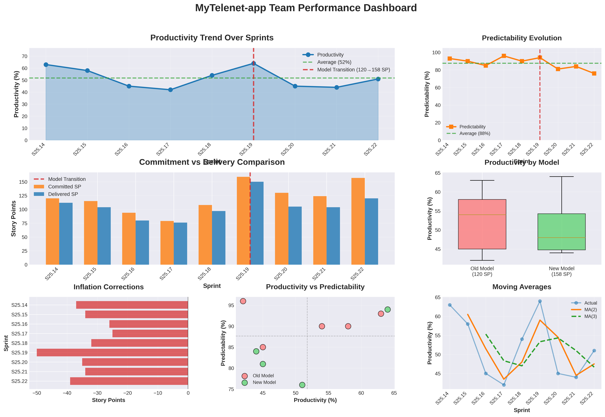

# Team Performance Analysis Generator

Automated tool for generating comprehensive team performance analysis dashboards and coaching reports from sprint data.

## Overview

This tool analyzes team sprint performance data and automatically generates:
1. **7-Chart Performance Dashboard** (PNG) - Visual analytics with professional formatting
2. **Coaching-Focused Analysis Report** (Markdown) - Detailed insights and recommendations

## Requirements

```bash
pip install pandas numpy matplotlib seaborn
```

## Usage

### Basic Usage

```bash
python generate_team_analysis.py <csv_file_path>
```

### Examples

```bash
# Analyze MyTelenet team
python generate_team_analysis.py MyTelenetAppTeamProductivity20251108.csv

# Analyze Design Systems team
python generate_team_analysis.py DesignSystemsTeamProducitvity20251108.csv

# Analyze DNE team
python generate_team_analysis.py DNETeamProducitvity20251108.csv
```

## Input Format

The CSV file must contain the following columns:

| Column | Type | Description |
|--------|------|-------------|
| Team | String | Team name |
| Sprint | String | Sprint identifier (e.g., "S25.08", "Design S25.09") |
| Target Velocity | Number | Target velocity for the sprint |
| Committed SP | Number | Story points committed |
| Delivered SP | Number | Story points delivered |
| Inflation correction | Number | Inflation adjustments (negative = underestimation) |
| Normalized Target Velocity | Number | Normalized velocity target |
| Normalized Planned SP | Number | Normalized planned points |
| Normalized Delivered SP | Number | Normalized delivered points |
| Normalized Inflation SP | Number | Normalized inflation |
| Productivity | Percentage | Productivity percentage (e.g., "65%" or 0.65) |
| Predictability | Percentage | Predictability percentage |
| Moving Average (2) | Number | 2-sprint moving average |
| Moving Average (3) | Number | 3-sprint moving average |
| Notes | String | Sprint notes and observations |

### Example CSV Structure

```csv
Team,Sprint,Target Velocity,Committed SP,Delivered SP,Inflation correction,...
MyTelenet-app,S25.8,120,/,/,/,...
MyTelenet-app,S25.14,120,120,112,-37,...
```

**Note:** Rows with "/" or "#VALUE!" in key columns are automatically filtered out.

## Output Files

### 1. Performance Dashboard (PNG)

**File naming:** `{TeamName}_Performance_Dashboard.png`

**Features:**
- High-resolution (300 DPI) for professional presentations
- 7 comprehensive visualizations:
  1. **Productivity Trend Line** - Sprint-over-sprint productivity with model transition markers
  2. **Predictability Evolution** - Commitment accuracy over time
  3. **Commitment vs Delivery** - Grouped bar chart comparing planned vs actual
  4. **Model Comparison Box Plot** - Statistical comparison of old vs new velocity models
  5. **Inflation Corrections** - Horizontal bars showing estimation adjustments
  6. **Productivity vs Predictability Scatter** - Correlation analysis
  7. **Moving Averages** - Trend smoothing with MA(2) and MA(3)
- Bold, small axis labels (8pt) for improved readability
- Consistent professional color scheme

### 2. Analysis Report (Markdown)

**File naming:** `{TeamName}_Performance_Analysis.md`

**Sections:**
- **Executive Summary** - Key findings and EBP readiness assessment
- **Performance Metrics** - Statistical analysis tables
- **Model Transition Analysis** - If velocity model changed during sprint range
- **Key Observations** - Productivity, predictability, and inflation patterns
- **Sprint Notes** - Contextual information from sprint notes
- **Visual Analysis Dashboard** - Dashboard interpretation guide
- **Coaching Recommendations** - Priority interventions with methods and success indicators
- **Bottom Line for Coaching** - Strengths, needs, and coaching stance

## Key Features

### Automatic Model Transition Detection

The tool automatically detects when a team transitions to a new velocity model (e.g., 20 SP → 69 SP) and:
- Marks the transition point on charts with a red dashed line
- Calculates separate statistics for old and new models
- Analyzes productivity and predictability changes

### Intelligent Analysis

- **Volatility Assessment**: Compares Coefficient of Variation against <15% benchmark
- **EBP Readiness**: Evaluates if team is ready for Epic-Based Pricing
- **Pattern Detection**: Identifies systematic inflation, productivity trends, capacity issues
- **Contextual Insights**: Incorporates sprint notes into analysis

### Professional Visualizations

- Clean, publication-ready charts
- Consistent color coding (blue=primary, orange=secondary, red=danger, green=success)
- Readable fonts with bold axis labels
- Automatic scaling and layout optimization

## Metrics Explained

### Productivity
- **Definition**: Percentage of target velocity delivered
- **Benchmark**: 75-85% for healthy teams
- **Calculation**: (Delivered SP / Target Velocity) × 100

### Predictability
- **Definition**: Percentage of committed work delivered
- **Benchmark**: 70-80% for consistent teams
- **Calculation**: (Delivered SP / Committed SP) × 100

### Coefficient of Variation (CV)
- **Definition**: Standard deviation as percentage of mean
- **Benchmark**: <15% for stable teams
- **Calculation**: (Std Dev / Mean) × 100

### Inflation
- **Definition**: Mid-sprint scope adjustments
- **Negative**: Underestimation (story complexity increased)
- **Positive**: Overestimation (story simplified)

## Interpretation Guide

### High Productivity + High Predictability
✅ **Healthy team** - Strong capability and planning discipline

### High Productivity + Low Predictability
⚠️ **Over-commitment** - Team delivers well but commits inconsistently

### Low Productivity + High Predictability
⚠️ **Conservative planning** - Team hits targets but may be sandbagging

### Low Productivity + Low Predictability
🚨 **Struggling team** - Systemic issues with estimation and delivery

### High CV (>20%)
🚨 **Volatile performance** - Unstable delivery rhythm, investigate root causes

### Frequent Inflation (>50% of sprints)
🚨 **Weak Definition of Ready** - Stories not ready when committed

## Troubleshooting

### "File not found" error
- Ensure the CSV file path is correct
- Use absolute path or run from the same directory as the CSV

### "No data found" error
- Check that CSV has rows with valid Productivity and Predictability values
- Ensure "/" and "#VALUE!" entries have corresponding valid data rows

### Charts look compressed
- Default size is 20×12 inches at 300 DPI
- Adjust `figsize` in code if needed for specific presentation formats

### Missing columns in CSV
- Verify CSV has all required columns (Team, Sprint, Target Velocity, etc.)
- Column names must match exactly (case-sensitive)

## Example Outputs

### Sample Dashboard


### Sample Report Excerpt
```markdown
## Executive Summary

**Key Findings:**
- **Productivity:** 52% average (below 75-85% benchmark)
- **Predictability:** 88% average
- **Volatility:** 16.3% coefficient of variation
- **Inflation:** -312 SP across 9 sprints (100% of sprints)

**Bottom Line:** Not ready for EBP until: reduce inflation frequency from 100% to <30%.
```

## Advanced Usage

### Batch Processing

Process multiple teams:

```bash
for csv in *TeamProductivity*.csv; do
    python generate_team_analysis.py "$csv"
done
```

### Custom Analysis Period

To analyze specific sprint ranges, edit the CSV to include only desired sprints before running the tool.

## Version History

- **v1.0** (2025-11-08): Initial release with 7-chart dashboard and comprehensive reporting
- Improved font clarity with 8pt bold axis labels
- Automatic model transition detection
- EBP readiness assessment

## Support

For issues or questions about the analysis methodology, refer to `Team_Performance_Analysis_Prompt.md` for detailed specifications.

## License

Enterprise Transformation Coaching AI Tool
