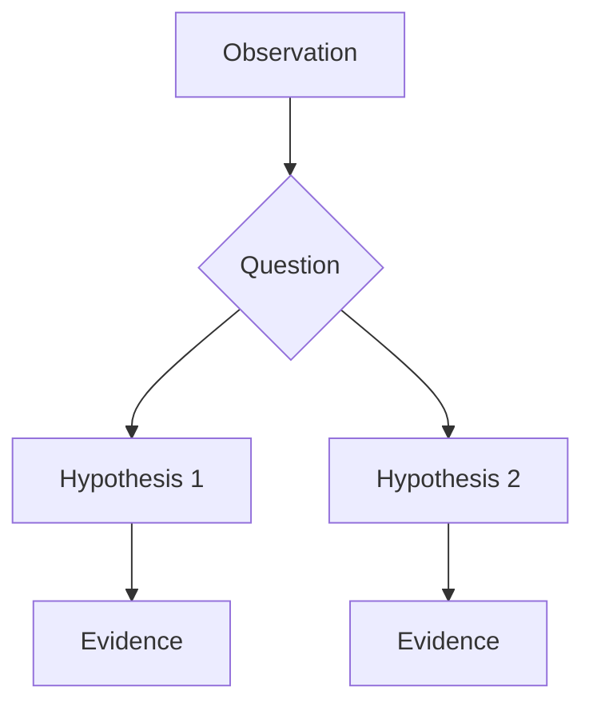
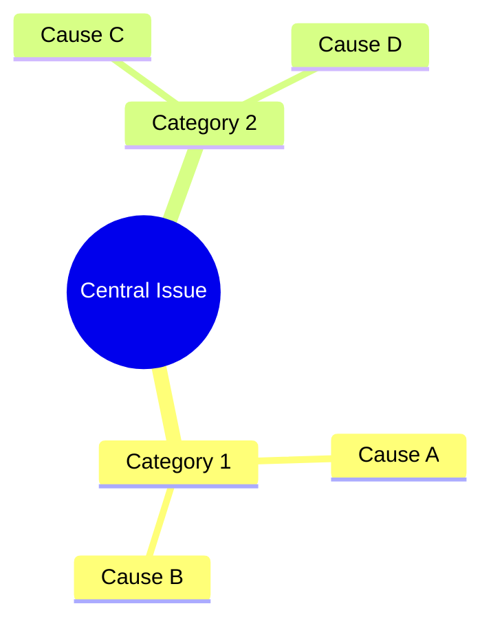
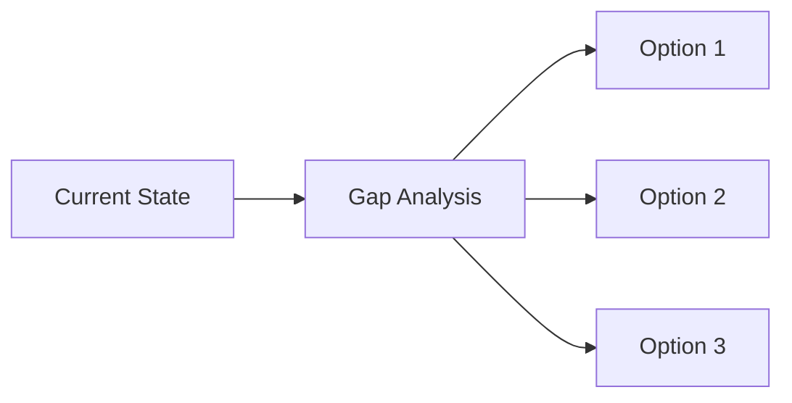

# Team Performance Analysis Prompt

## Objective
Analyze a single team's sprint performance data and generate a concise coaching-focused report with clean visualizations.

## Input Required
A CSV file with the following structure:
```
Team, Sprint, Target Velocity, Committed SP, Delivered SP, Inflation correction, 
Normalized Target Velocity, Normalized Planned SP, Normalized Delivered SP, 
Normalized Inflation SP, Productivity, Predictability, Moving Average (2), 
Moving Average (3), Notes
```

## Analysis Tasks

### 1. Data Processing
- Read the CSV file and validate data quality
- Convert percentage strings to numeric values for analysis
- Identify velocity model transitions (e.g., 20 SP → 69 SP)
- Calculate statistical metrics: mean, std dev, coefficient of variation
- Detect anomalies and patterns in sprint performance

### 2. Performance Dashboard Creation
Create a **single comprehensive PNG image** with 7 visualizations:

**Chart Requirements:**
1. **Productivity Trend Line** (Top Left, 2/3 width)
   - Line chart with markers showing productivity over sprints
   - Use actual sprint names (e.g., S25.08, S25.09) on X-axis
   - Mark velocity model transition with vertical red dashed line
   - Show average productivity as horizontal green dotted line
   - Fill area under the curve with transparency

2. **Predictability Trend Line** (Top Right, 1/3 width)
   - Line chart showing predictability evolution
   - Same sprint name labeling as productivity chart
   - Mark transition point and average line

3. **Commitment vs Delivery Bar Chart** (Middle Left, 2/3 width)
   - Grouped bars: Committed SP (orange) vs Delivered SP (blue)
   - Sprint names on X-axis
   - Highlight model transition

4. **Model Comparison Box Plot** (Middle Right, 1/3 width)
   - Two boxes: Old Model vs New Model productivity
   - Color-coded: red tint for old, green tint for new

5. **Inflation Corrections Horizontal Bar** (Bottom Left)
   - Horizontal bars showing inflation per sprint
   - Negative values in red, positive in green
   - Sprint names on Y-axis

6. **Productivity vs Predictability Scatter** (Bottom Center)
   - Scatter plot with two colors: old model (red) vs new model (teal)
   - Quadrant lines at average values

7. **Moving Average Trends** (Bottom Right)
   - Three lines: Actual, MA(2), MA(3)
   - Sprint names on X-axis

**Visual Standards:**
- Figure size: 20x12 inches
- DPI: 300 (high quality)
- Font sizes: Title 14-18pt bold, labels 12pt bold, legend 9-10pt
- Color scheme: Professional blues, oranges, teals, reds
- Grid: Light gray, alpha 0.3
- All X-axis sprint labels rotated 45° for readability

### 3. Analysis Report Generation

Create a **concise markdown report** with the following structure:

#### Executive Summary (Max 4 bullet points)
- Key productivity and predictability metrics
- Critical finding (paradox, pattern, or concern)
- Bottom-line assessment (EBP readiness or major gap)
- One actionable insight

#### Performance Analysis (Max 5 findings)
Each finding includes:
- **Bold title** describing the pattern
- 2-3 sentences of evidence
- One Mermaid diagram (flowchart, mindmap, or graph) illustrating root causes or relationships
- No dates or timelines—only patterns and coaching insights

**Required Findings:**
1. Velocity transition impact (if applicable)
2. Inflation pattern analysis
3. Statistical anomalies or outliers
4. External factor impacts (holidays, capacity changes)
5. Trend trajectory and stability assessment

#### Coaching Conversation Framework
**Opening Questions** (3-5 questions)
- Curiosity-driven, non-judgmental
- Grouped by theme: transition, productivity, inflation, external factors

**Insight Sharing Pattern: "Notice → Wonder → Explore"**
- 2-3 examples of how to share observations
- Avoid prescriptive language

**Co-Creation Approaches**
- "What if we tried..." phrasing
- Experiment design suggestions
- No mandated solutions

#### Risk Assessment Table
| Risk | Evidence | Impact | Coaching Response |
- 4-6 key risks with data-backed evidence
- Focus on patterns, not individual sprints

#### Coaching Interventions (4-6 workshops/experiments)
Each intervention includes:
- Purpose (one sentence)
- Method (2-3 bullets)
- Success indicator (measurable)
- **NO dates, timelines, or quarter references**

**Example Interventions:**
- Inflation root cause workshop
- Estimation confidence protocol
- Capacity-adjusted planning
- Stretch goal experiment
- Velocity stabilization focus

#### Visual Analysis Summary
- Brief 3-4 sentence interpretation of dashboard
- Highlight most critical visual insight

#### Bottom Line for Coaching
**What the Team Has** (3 bullets)
**What the Team Needs** (3 bullets)
**What to Avoid** (3 bullets)
**Coaching Stance** (paragraph)
**Next Conversation Prep** (5 bullet checklist)

### 4. Output Files
Generate exactly 2 files:
1. `{TeamName}_Performance_Dashboard.png` - Comprehensive 7-chart visualization
2. `{TeamName}_Performance_Analysis.md` - Concise coaching report (max 3,500 words)

## Quality Standards

### Data Accuracy
- ✓ All calculations verified against source data
- ✓ Percentage conversions handled correctly (decimal vs whole number)
- ✓ Moving averages calculated with proper window sizes
- ✓ Statistical metrics (CV, std dev) computed accurately

### Visual Clarity
- ✓ All sprint names displayed (not "Sprint 1, 2, 3...")
- ✓ Consistent color schemes across all charts
- ✓ Readable labels and legends
- ✓ No overlapping text
- ✓ Professional aesthetics

### Report Conciseness
- ✓ Executive summary: 4 bullets max
- ✓ Each finding: 1 diagram + 3-4 sentences
- ✓ Total report length: 2,500-3,500 words
- ✓ No redundant content
- ✓ Coaching-focused, not project management focused

### Coaching Orientation
- ✓ Questions over statements
- ✓ Curiosity over judgment
- ✓ Co-creation over prescription
- ✓ Pattern recognition over blame
- ✓ Psychological safety emphasis

## Execution Instructions

### Step 1: Read Data
```python
import pandas as pd
df = pd.read_csv('team_performance.csv', encoding='utf-8-sig')
# Validate data structure
# Convert percentages to numeric
# Identify transition points
```

### Step 2: Calculate Metrics
```python
# Overall statistics
avg_productivity = df['Productivity_num'].mean()
avg_predictability = df['Predictability_num'].mean()
productivity_cv = (df['Productivity_num'].std() / avg_productivity) * 100

# Phase comparison (pre/post transition)
old_model_stats = df[df['Target Velocity'] == 20].describe()
new_model_stats = df[df['Target Velocity'] == 69].describe()

# Inflation analysis
total_inflation = df['Inflation correction'].sum()
inflation_frequency = len(df[df['Inflation correction'] != 0])
```

### Step 3: Create Visualizations
```python
import matplotlib.pyplot as plt
import seaborn as sns

fig = plt.figure(figsize=(20, 12))
gs = fig.add_gridspec(3, 3, hspace=0.3, wspace=0.3)

# Create 7 subplots following specifications
# Use actual sprint names from df['Sprint']
# Apply professional styling
# Save as high-res PNG
```

### Step 4: Generate Report
```python
# Use structured template
# Include Mermaid diagrams for each finding
# Follow coaching conversation framework
# Keep concise - max 3,500 words
```

### Step 5: Validate Quality
- [ ] Dashboard uses actual sprint names, not numbers
- [ ] All 7 charts present and properly formatted
- [ ] Report has executive summary with 4 bullets max
- [ ] No dates or timelines in recommendations
- [ ] Coaching questions are curiosity-driven
- [ ] Mermaid diagrams render correctly
- [ ] Total word count under 3,500

## Critical Success Factors

### 1. Sprint Name Accuracy
**CRITICAL:** Always use actual sprint names (e.g., "S25.08", "S24.23") on all chart X-axes.
**NEVER** use generic numbering like "Sprint 1, 2, 3..."

### 2. Coaching vs. Project Management Tone
**DO:** "I notice productivity jumped at Sprint 15. What changed?"
**DON'T:** "Team must improve productivity to 75% by Q2 2026"

### 3. Conciseness
- Each finding: **Max 1 paragraph + 1 diagram**
- Executive summary: **Max 4 bullets**
- Avoid repetitive explanations

### 4. Data Integrity
- Verify all percentages are correctly interpreted (0.50 = 50%, not 0.50%)
- Ensure inflation corrections maintain sign (negative is bad)
- Validate moving averages against manual calculations

### 5. Visual Professionalism
- High DPI (300) for print quality
- Consistent color palette
- Clear legends and labels
- No cluttered axes

## Example Usage

**Input:** `DNE.csv` (15 sprints of data)

**Output 1:** `DNE_Performance_Dashboard.png`
- 20x12 inch, 300 DPI visualization
- 7 charts with sprint names S25.08 through S25.22
- Professional color scheme and formatting

**Output 2:** `DNE_Performance_Analysis.md`
- 3,200 words, coaching-focused
- Executive summary with 4 key points
- 5 findings with Mermaid diagrams
- Coaching conversation framework
- 6 intervention suggestions (no dates)
- Bottom-line coaching stance

## Key Patterns to Detect

### Velocity Transition Pattern
- Sudden jump in committed/delivered SP
- Change in predictability post-transition
- Productivity delta analysis

### Sandbagging Pattern
- High predictability + Low productivity
- Conservative commitment behavior
- Underutilization of capacity

### Inflation Dysfunction
- Persistent negative corrections
- >50% of sprints with inflation
- Systematic estimation gaps

### External Volatility
- Holiday/event impacts on productivity
- Capacity-adjusted performance
- Predictability during constraints

### Anomaly Sprints
- >100% productivity (investigate carryover)
- <20% productivity (investigate blockers)
- 100% predictability + low delivery

## Mermaid Diagram Templates

### Flowchart (Decision Tree)


### Mindmap (Root Cause)


### Graph (Relationships)


## Final Checklist

Before delivering analysis:
- [ ] CSV data read correctly with all columns
- [ ] Sprint names extracted and used in all charts
- [ ] 7 visualizations created and saved as PNG
- [ ] Dashboard file named: `{Team}_Performance_Dashboard.png`
- [ ] Executive summary has exactly 4 bullets
- [ ] Each finding has 1 Mermaid diagram
- [ ] No dates/quarters/timelines in recommendations
- [ ] Coaching questions are open-ended and curious
- [ ] Risk assessment table included
- [ ] 4-6 coaching interventions with success indicators
- [ ] Bottom-line coaching stance written
- [ ] Report file named: `{Team}_Performance_Analysis.md`
- [ ] Total word count: 2,500-3,500 words
- [ ] All metrics verified against source data
- [ ] Visual quality: 300 DPI, professional colors

## Success Criteria

**Analysis Quality:**
- Statistical accuracy: 100%
- Pattern detection: Identifies all major trends
- Insight depth: Goes beyond surface observations

**Visual Quality:**
- Chart clarity: All labels readable
- Color consistency: Professional palette
- Sprint accuracy: Actual names used

**Report Quality:**
- Conciseness: Under 3,500 words
- Coaching tone: Questions over directives
- Actionability: Clear interventions with success metrics

**Delivery:**
- 2 files generated
- Proper naming convention
- Ready for stakeholder review
