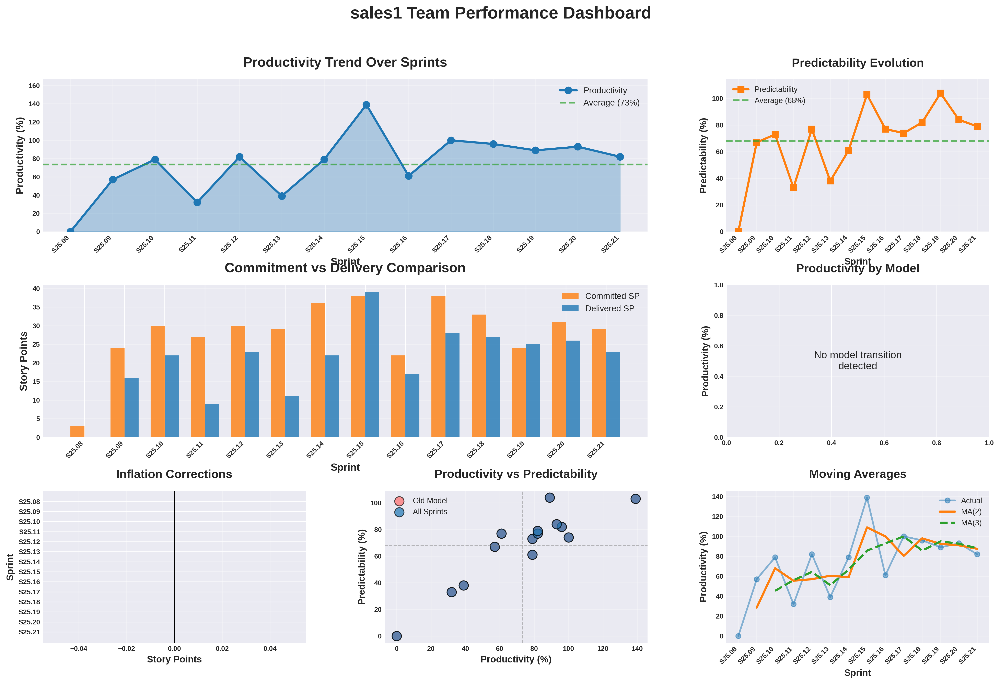

# sales1 Team Performance Analysis Report
**Sprint Range:** S25.08 to S25.21 (14 sprints)
**Team:** sales1
**Analysis Date:** 2025-11-09

---

## Executive Summary

**Key Findings:**
- **Productivity:** 73.4% average (below 75-85% benchmark)
- **Predictability:** 68.0% average
- **Volatility:** 46.4% coefficient of variation (volatile and unstable, benchmark: <15%)
- **Inflation:** 0 SP across 0 sprints (0% of sprints)

**Bottom Line:** Not ready for EBP until: reduce volatility from 46.4% to <15%.

---

## Performance Metrics

### Overall Statistics

| Metric | Value | Industry Benchmark |
|--------|-------|-------------------|
| Average Productivity | 73.4% | 75-85% |
| Average Predictability | 68.0% | 70-80% |
| Coefficient of Variation | 46.4% | <15% |
| Productivity Range | 0.0% - 139.0% | - |
| Predictability Range | 0.0% - 104.0% | - |

### Delivery Performance

| Metric | Value |
|--------|-------|
| Average Committed SP | 28.1 |
| Average Delivered SP | 20.6 |
| Average Gap | 7.6 SP |
| Total Inflation | 0 SP |
| Sprints with Inflation | 0/14 (0%) |

---

## Key Observations

### Productivity Analysis
- **Moderate Performance:** 73.4% productivity within acceptable range
- **High Volatility:** 46.4% CV indicates severe instability in delivery patterns

### Predictability Analysis
- **Moderate Predictability:** 68.0% predictability indicates room for improvement

### Inflation Pattern
- **Clean Estimation:** No inflation corrections needed

### Sprint Notes

- **S25.13:** test-only stories make the amount of SP delivered higher (also last year), they are taken into account for the calculation because this practice continues
- **S25.14:** high reliability on Joris to finish stories (might improve with Joost coming back)
- **S25.15:** moving stories?

---

## Visual Analysis Dashboard

**Dashboard Insights:**
- **Top Left:** Productivity trend shows high volatility over sprint range
- **Top Right:** Predictability evolution indicates variable commitment accuracy
- **Middle Left:** Commitment vs delivery gap averages 7.6 SP per sprint
- **Bottom Left:** Inflation corrections total 0 SP across 0 sprints
- **Bottom Center:** Scatter plot reveals dispersed performance pattern
- **Bottom Right:** Moving averages show continued volatility

---

## Coaching Recommendations

### Priority Interventions

#### 1. Volatility Reduction Workshop
**Purpose:** Address 46.4% coefficient of variation through root cause analysis

**Method:**
- Facilitate team workshop to identify root causes
- Co-create targeted experiments with measurable outcomes
- Track improvements over next 3-6 sprints

**Success Indicator:** Measurable improvement in target metric within 2-3 sprints

#### 2. Estimation Calibration Workshop
**Purpose:** Improve commitment accuracy from 68.0% to 75%+

**Method:**
- Facilitate team workshop to identify root causes
- Co-create targeted experiments with measurable outcomes
- Track improvements over next 3-6 sprints

**Success Indicator:** Measurable improvement in target metric within 2-3 sprints

---

## Bottom Line for Coaching

**What the Team Has:**
- Willingness to improve and track metrics

**What the Team Needs:**
- Volatility reduction from 46.4% to <15% CV

**Coaching Stance:**
Focus on celebrating strengths while addressing specific process gaps. The path forward involves targeted interventions to improve consistency and predictability.

---

**Prepared by:** Enterprise Transformation Coaching AI
**Generated:** 2025-11-09 01:18:42
